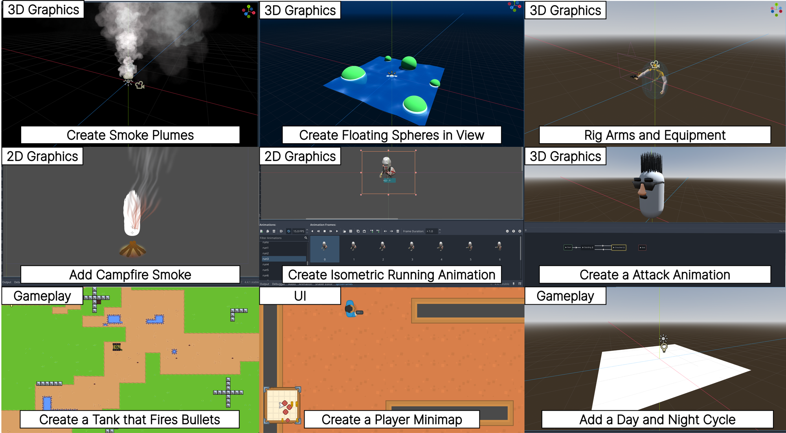
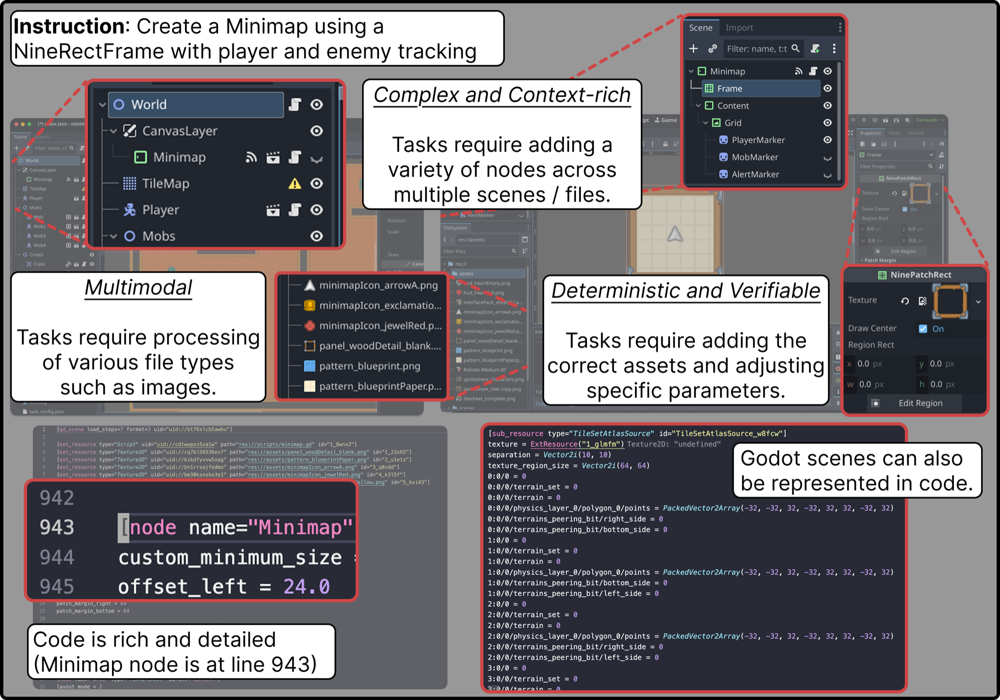

<div align="center">

<h1>GameDevBench</h1>
<h3>Evaluating Agentic Capabilities Through Game Development</h3>

**Wayne Chi, Yixiong Fang, Arnav Yayavaram, Siddharth Yayavaram, Seth Karten,<br>Qiuhong Anna Wei, Runkun Chen, Alexander Wang, Valerie Chen, Ameet Talwalkar, Chris Donahue**

*Carnegie Mellon University &nbsp;·&nbsp; Princeton University*

<br>

[](https://icml.cc/)
[](https://waynechi.com/gamedevbench)
[](https://arxiv.org/abs/2602.11103)
[](https://huggingface.co/papers/2602.11103)
[](https://godotengine.org/)
[](LICENSE)

<br>

*The first benchmark for evaluating LLM agents on game development tasks in a modern game engine &mdash; 333 tasks, published at ICML 2026.*



</div>

<br>

## Abstract

Despite rapid progress on coding agents, progress on their multimodal counterparts has lagged behind. A key challenge is the scarcity of evaluation testbeds that combine the complexity of software development with the need for deep multimodal understanding. Game development provides such a testbed as agents must navigate large, dense codebases while manipulating intrinsically multimodal assets such as shaders, sprites, and animations within a visual game scene.

We present **GameDevBench**, the first benchmark for evaluating agents on game development tasks. GameDevBench consists of 333 tasks derived from web and video tutorials. Tasks require significant multimodal understanding and are complex — the average solution requires over three times the lines of code and file changes compared to prior software development benchmarks. Agents struggle with game development, with the best agent and method solving only **53.8%** of tasks. We find a strong correlation between perceived task difficulty and multimodal complexity, with average success rate dropping from **51.4%** on gameplay-oriented tasks to **33.0%** on 2D graphics tasks.

To improve multimodal capability, we introduce two simple image and video-based feedback mechanisms for agents. Despite their simplicity, these methods consistently improve performance, increasing GPT-5.4's performance from **41.1%** to **52.0%** when given visual feedback. We release GameDevBench publicly to support further research into agentic game development.

## Overview

GameDevBench contains **333 game development tasks** to evaluate LLM agents' ability to complete game development problems in the **Godot game engine**. Tasks span four categories — **2D Graphics & Animation** (33.3%), **3D Graphics & Animation** (26.7%), **User Interface** (20.1%), and **Gameplay Logic** (19.8%) — and require agents to reason about multimodal assets including shaders, sprites, animations, and visual game scenes. On average, a reference solution edits **4.7 files** and **114 lines of code** across **3.2 distinct filetypes**.

<p align="center">
  
</p>

## Getting Started

### Prerequisites

- **Godot 4.x** — Download from [godotengine.org](https://godotengine.org/download). Ensure `godot` is in your PATH or set `GODOT_EXEC_PATH`.
- **Python 3.10+** (Python 3.12+ for OpenHands)
- **Node.js ≥18** — only needed for the Godot-targeted `--mcp-server godot` server (run via `npx`); see [Godot-Specific Tooling](#godot-specific-tooling).

### Install an Agent

| Agent | Install Guide |
|-------|---------------|
| Claude Code | [code.claude.com](https://code.claude.com/docs/en/overview) |
| Codex | [openai.com/codex](https://openai.com/codex/) |
| Gemini CLI | [geminicli.com](https://geminicli.com/) |
| OpenHands | [openhands.dev](https://www.openhands.dev/) |

### Setup Tasks

```bash
bash unzip_tasks.sh
```

> Tasks are distributed as individual zip files to prevent accidental data leakage.

### Verify Your Setup

Every ground-truth solution should pass validation. To check your install (Godot, unzipped tasks) or the integrity of a release, run:

```bash
uv run python validate_tasks.py        # validates all 333 ground truths in parallel
```

### Configuration

You can use the built-in plans for `claude-code`, `codex`, and `gemini-cli`, or provide API keys directly. For OpenHands you must provide your own API keys. See [`.env.example`](.env.example) for details.

## Usage

```bash
uv run python gamedevbench/src/benchmark_runner.py \
  --agent AGENT \
  --model MODEL \
  run --task-list tasks.yaml
```

### Options

| Flag | Description |
|------|-------------|
| `--agent AGENT` | Agent to use *(required)* |
| `--model MODEL` | Model name (e.g., `claude-sonnet-4-5-20250929`) |
| `--enable-mcp` | Enable an MCP server for the agent |
| `--mcp-server NAME` | Which MCP server to wire in (`screenshot` default, or `godot`); see [Godot-Specific Tooling](#godot-specific-tooling) |
| `--use-runtime-video` | Append Godot runtime instructions to prompts |
| `--skip-display` | Skip tasks that require a display |
| `run --task-list FILE` | Task list YAML (e.g., `tasks.yaml`) |

### Platform Notes

MCP screenshot functionality (`--enable-mcp`) is **cross-platform** (Windows, macOS, Linux) via [`mss`](https://pypi.org/project/mss/). Set `GODOT_SCREENSHOT_DISPLAY` to the 1-indexed monitor to capture (`1` = primary); out-of-range values fall back to the primary monitor.

### Godot-Specific MCP Servers

`--enable-mcp` turns MCP on and `--mcp-server NAME` picks which server:

| `--mcp-server` | Server | Notes |
|----------------|--------|-------|
| `screenshot` *(default)* | bundled editor-screenshot server (`mss`, cross-platform) | Captures a whole monitor, so runs are forced to `--workers 1`. Set `GODOT_SCREENSHOT_DISPLAY` to the 1-indexed monitor (`1` = primary; out-of-range falls back to primary). |
| `godot` | [`@coding-solo/godot-mcp`](https://github.com/Coding-Solo/godot-mcp) | Godot-targeted tools (run/stop project, debug output, scene/node editing, project info, UID/mesh-library management). Headless — safe to run in parallel (`--workers N`). Currently honored only by `--agent openhands`. |

**`godot` server prerequisites & first run:**

- Needs **Node.js ≥18**; the server is launched via `npx -y @coding-solo/godot-mcp`. `GODOT_PATH` is taken from `GODOT_EXEC_PATH` / `GODOT_PATH` / `godot` on PATH.
- The **first launch downloads the package**. The runner pre-fetches it once before dispatching workers, so parallel tasks don't each download it (and the download isn't charged against a task's solve timeout). For a one-off/single-task run, or to warm the cache manually beforehand, run:

  ```bash
  npx -y @coding-solo/godot-mcp < /dev/null   # downloads, starts, exits on EOF
  ```

- ⚠️ **Run under a virtual display (Linux).** Unlike the headless screenshot baseline, godot-mcp exposes a `launch_editor` tool that opens a **real Godot editor GUI window**. Agents sometimes call it; those windows pop onto your desktop, can conflict with a project you have open ("reload scene from disk?"), and may leak as orphaned processes. Wrap the whole run in `xvfb-run` so every editor/window lands on a throwaway virtual display instead of your session:

  ```bash
  xvfb-run -a uv run python gamedevbench/src/benchmark_runner.py \
    --agent openhands --model deepseek-v4-pro \
    --enable-mcp --mcp-server godot --workers 8 \
    --run-name deepseek-godotmcp \
    run --task-list tasks.yaml
  ```

  Without `xvfb-run`, if you see stray Godot editor windows after a run, they're sandboxed (working dir under `/tmp/gamedevbench_sandbox_*`, not your repo) and safe to `pkill -f 'godot --editor'`.

## Results

The official ICML 2026 camera-ready results are included in [`results/`](results/) — one JSON per (agent, model, feedback) configuration with per-task pass/fail status, token usage, costs, and durations, plus a [`leaderboard.csv`](results/leaderboard.csv) summary. New benchmark runs are also saved to `results/`.

| Rank | Model | Harness | Feedback | pass@1 (%) |
|-----:|-------|---------|----------|-----------:|
| 1 | gemini-3-pro-preview | Gemini CLI | Screenshot + Video | **53.8** |
| 2 | gpt-5.4 | Codex | Screenshot + Video | 52.0 |
| 3 | gemini-3-flash-preview | Gemini CLI | Video | 46.9 |
| 4 | gpt-5.4-mini | Codex | Video | 43.2 |
| 5 | gpt-5.4-mini | OpenHands | Baseline | 38.4 |
| 6 | claude-sonnet-4-5 | Claude Code | Screenshot + Video | 34.8 |
| 7 | gemini-3-flash-preview | OpenHands | Screenshot + Video | 31.8 |
| 8 | deepseek-v4-pro | OpenHands | Baseline | 29.1 |
| 9 | kimi-k2.5 | OpenHands | Screenshot + Video | 20.7 |
| 10 | claude-haiku-4-5 | Claude Code | Video | 18.6 |
| 11 | claude-haiku-4-5 | OpenHands | Screenshot + Video | 17.7 |
| 12 | qwen3.5-397b | OpenHands | Baseline | 5.4 |

*Best-performing multimodal feedback configuration per model + harness pair. Screenshot = editor screenshot MCP server; Video = runtime gameplay video instructions. See the [project page](https://waynechi.com/gamedevbench) for the full leaderboard.*

### Godot-Specific Tooling

A separate track measuring **Godot-targeted MCP servers against generic, non-Godot tooling**, holding the model and harness fixed and varying only the tooling. Each configuration is isolated with `--run-name` so its `results/` are directly comparable against the generic/no-MCP baseline. See [Godot-specific MCP servers](#godot-specific-mcp-servers) under Usage for how to select and run these.

| Model | Harness | Tooling | pass@1 (%) | Avg tokens/task | Avg cost/task (USD) |
|-------|---------|---------|-----------:|----------------:|--------------------:|
| deepseek-v4-pro | OpenHands | Generic (no Godot MCP) | **29.1** | 1.19M | $0.052 |
| deepseek-v4-pro | OpenHands | godot-mcp ([`@coding-solo/godot-mcp`](https://github.com/Coding-Solo/godot-mcp)) | 24.6 | 1.52M | $0.056 |

*Comparison for the Godot-tooling track (DeepSeek is text-only, so the screenshot MCP path is not used). pass@1 over all 333 tasks; solver timeouts and errors count as failures. **Token and cost columns are reported because the model is held fixed (deepseek-v4-pro), so they isolate the tooling's effect on context size and spend.** Tokens are input+output summed per task (avg over 333); cost uses DeepSeek API pricing.*

***Result: the Godot-targeted MCP underperformed the generic baseline on every axis*** — −4.5pp pass@1 (82 vs 97 solves), +28% tokens, +9% cost, and far more runaway trajectories (14 vs 2 tasks over the 600s cap). For a text-only model, wrapping Godot operations in MCP tools that mostly duplicate the shell inflated context (tool schemas + `get_debug_output` dumps fed back each turn) without a corresponding gain. *Baseline tokens/cost use the 8 pre-watchdog outlier tasks re-run under the current 600s cap for an apples-to-apples comparison; baseline pass@1 is unchanged (29.1%). The published [leaderboard](#results) row keeps the original camera-ready 29.1% / 1.29M-token figures.*

## Citation

If you find GameDevBench useful, please cite our paper:

```bibtex
@misc{chi2026gamedevbenchevaluatingagenticcapabilities,
      title={GameDevBench: Evaluating Agentic Capabilities Through Game Development},
      author={Wayne Chi and Yixiong Fang and Arnav Yayavaram and Siddharth Yayavaram and Seth Karten and Qiuhong Anna Wei and Runkun Chen and Alexander Wang and Valerie Chen and Ameet Talwalkar and Chris Donahue},
      year={2026},
      eprint={2602.11103},
      archivePrefix={arXiv},
      primaryClass={cs.AI},
      url={https://arxiv.org/abs/2602.11103},
}
```

## License

This project is licensed under the [Apache License 2.0](LICENSE).
